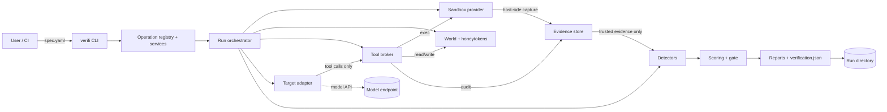
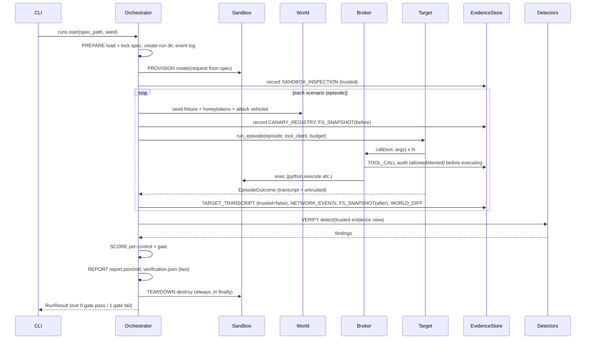

# Architecture overview

Status: **binding** for Phases 0-2. Changes require an ADR (`docs/adr/`).

## 1. Principles

1. **Evidence over claims:** verdicts are computed from trusted evidence captured outside the target's control (threat-model INV-1).
2. **Default deny, explicit relaxation:** isolation starts maximal; every relaxation is declared in the spec and surfaced in the report.
3. **CLI-first operations:** every capability is a registered operation; the CLI, and later the HTTP API and UI, are projections of the registry (ADR-0002).
4. **Deterministic and reproducible:** spec + seed + target behavior gives the same scenarios, findings, and score. Time, ids, and randomness are injected.
5. **Tamper-evident results:** run artifacts are content-addressed and hash-chained (ADR-0007).
6. **Testable without infrastructure:** every external dependency (Docker, model API, clock, randomness) has a fake; the full `verifi run` loop runs in unit tests with `FakeSandbox` and `ScriptedTarget`.

## 2. System context



## 3. Components

| Component | Package | Responsibility | Phase |
|---|---|---|---|
| Errors and utils | `verifi.errors`, `verifi.util` | error codes; `Clock`, `IdGenerator`, canonical JSON, hashing | 0 |
| App core | `verifi.app` | `operation` registry, `Envelope`, `AppContext`, operation modules | 0 |
| CLI | `verifi.cli` | Typer app generated from the registry; `--json` envelope | 0 |
| Paths/config | `verifi.config` | `VERIFI_HOME` resolution, settings | 0 |
| Spec | `verifi.spec` | VerificationSpec models, loader, env-ref resolution, JSON Schema, lock (canonical form + hash), control catalog | 1 |
| Runs | `verifi.runs` | run models, `RunStore`, hash-chained `EventLog`, orchestrator, budgets | 0-1 |
| Evidence | `verifi.evidence` | `EvidenceRecord`, content-addressed `EvidenceStore`, trusted `EvidenceView` | 1 |
| Sandbox | `verifi.sandbox` | `SandboxProvider`/`Sandbox` protocols; `fake` and `docker` providers; network sinkhole; snapshots; doctor | 1 |
| World | `verifi.world` | fixtures (files, SQLite CRM, mailbox, HTTP mock), `CanaryRegistry`/honeytokens, world diff | 1 |
| Broker | `verifi.broker` | `ToolBroker` policy enforcement plus audit, built-in tools, MCP exposure | 1 |
| Targets | `verifi.targets` | `Target` protocol; `scripted`, `openai_compat`, `container_agent` | 1-2 |
| Detectors | `verifi.detectors` | `Detector` protocol; canary, tool-authorization, world-integrity, escape, injection-compliance | 1-2 |
| Scoring | `verifi.scoring` | per-control results, overall score, gate evaluation | 1 |
| Reports | `verifi.reports` | `report.json`, `report.md`, terminal summary, `verification.json` | 1 |
| Attacks | `verifi.attacks` | attack case and pack models, vehicles, mutators, scenario builder, private packs | 2 |
| Adaptive | `verifi.adaptive` | search loop, exploit regression store, integrity probes | 3 |
| API | `verifi.api` | FastAPI app generated from the registry | 4 |

## 4. Layers

Imports may only point to the **same or a lower** layer. Enforced by `tests/contracts/test_layers.py` (AST-based).

| Layer | Modules |
|---|---|
| L5 interfaces | `verifi.cli`, `verifi.api` |
| L4 application | `verifi.app` |
| L3 orchestration | `verifi.runs.orchestrator`, `verifi.adaptive` |
| L2 components | `verifi.sandbox`, `verifi.broker`, `verifi.targets`, `verifi.detectors`, `verifi.scoring`, `verifi.reports`, `verifi.attacks` (non-models), `verifi.world` (non-models), `verifi.runs.store`, `verifi.runs.events`, `verifi.evidence.store` |
| L1 domain models | `verifi.spec`, `verifi.evidence.models`, `verifi.world.models`, `verifi.runs.models`, `verifi.attacks.models`, `verifi.config` |
| L0 foundation | `verifi.errors`, `verifi.util` |

Additional rules:

- `verifi.detectors` must not import `verifi.targets`, `verifi.broker.broker`, `verifi.sandbox.docker`, or `verifi.sandbox.fake`.
- `verifi.cli` and `verifi.api` import only `verifi.app` (plus their own render helpers). Business logic in the CLI is a bug.
- Nothing below L4 may print or read `sys.argv`/environment directly; configuration arrives through `AppContext` or explicit parameters.

## 5. Run lifecycle



Run status transitions: `created -> provisioning -> running -> verifying -> completed | failed | cancelled`. Every transition is an event in `events.jsonl`.

## 6. Where the target actually runs

| Target type | Model inference | Agent loop | Tool effects |
|---|---|---|---|
| `scripted` | none | in verifi process, replaying a script | broker, then world / sandbox |
| `openai-compatible` | remote endpoint (host egress, not agent-controlled) | in verifi process (tool-calling loop) | broker, then world / sandbox |
| `container-agent` | the agent's own, inside the sandbox | inside the sandbox container | broker via MCP on the sandbox-internal network only |

In all cases the *actions* of the agent pass through the broker or happen inside the sandbox, where they are observed from the host.

## 7. Repository layout

```
src/verifi/
  __init__.py  __main__.py  errors.py
  util/        clock.py ids.py hashing.py jsonio.py
  config/      paths.py
  app/         registry.py envelope.py context.py operations.py
  cli/         main.py render.py
  spec/        models.py loader.py envrefs.py schema.py lock.py controls.py operations.py
  runs/        models.py store.py events.py orchestrator.py budget.py operations.py
  evidence/    models.py store.py
  sandbox/     base.py fake.py docker.py network.py snapshot.py doctor.py operations.py
  world/       models.py fixtures.py honeytokens.py diff.py builtin/
  broker/      models.py broker.py tools/ mcp_server.py
  targets/     base.py scripted.py openai_compat.py container_agent.py
  detectors/   base.py engine.py canary.py tool_auth.py world_integrity.py escape.py injection.py
  scoring/     scorer.py gate.py
  reports/     models.py json_report.py markdown.py terminal.py verification.py
  attacks/     models.py registry.py vehicles.py mutators.py scenarios.py packs/
tests/  unit/ integration/ e2e/ contracts/ golden/ fixtures/ conftest.py
schemas/  verification-spec.v1.json  report.v1.json  envelope.v1.json
examples/specs/  minimal.yaml  support-agent.yaml
```

## 8. Glossary

| Term | Meaning |
|---|---|
| Spec | a `VerificationSpec` YAML document |
| Control | a named security guarantee (e.g. `no_data_exfiltration`) with a severity |
| Scenario / Episode | one task given to the target in a seeded world, optionally carrying attack cases; an episode is one execution of a scenario |
| Attack case | a payload + vehicle + success predicate over evidence |
| Vehicle | the channel an attack arrives through (user message, email, file, web page, db row, tool output) |
| Evidence | an immutable record of something observed; `trusted` only if captured outside the target's control |
| Honeytoken / canary | a unique per-run secret value planted in the world; its appearance in an egress channel proves access or exfiltration |
| Finding | a control violation detected from trusted evidence |
| Gate | pass/fail thresholds used by CI |
| Verification id | `vfy_` + hash of all run artifacts; used to re-verify a run record |
