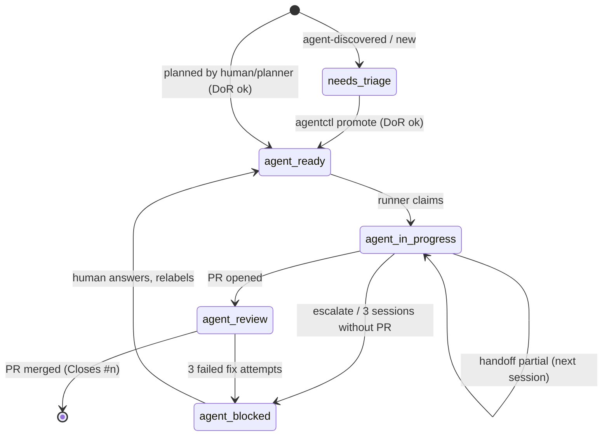

# Workflow: roles, issues, labels, branches, merges

## Roles

| Role | Who | Does | Never |
|---|---|---|---|
| Owner | human | sets direction, answers `needs:human`, approves `risk:high`, maintains labels and secrets | |
| Architect / maintainer | human, or Claude Code when asked | architecture docs, ADRs, harness (`AGENTS.md`, skills, scripts, CI), spikes, backlog shaping | runs the tick loop; claims `agent:*` issues unless told to |
| Runner | `scripts/agent/tick.py` on a schedule | deterministic queue decisions, merges, escalations; starts one opencode session per tick | writes code |
| Implementer | opencode agent `implementer` | one issue: TDD, minimal diff, gate, PR | merges, edits protected paths |
| Reviewer | opencode subagent `reviewer` | read-only pre-PR review | edits |
| Triager | opencode agent `triager` | makes `needs:triage` issues DoR-complete, promotes | edits code |
| Planner | opencode agent `planner` | decomposes epics into tasks; creates spikes for missing decisions | edits code or docs; invents architecture |

## Issue hierarchy and ordering

```
Milestone  "Phase N: ..."            (phase:N label)
  Epic     type:epic                 (GitHub sub-issues list its tasks)
    Task   type:task | type:bug | type:chore | type:docs | type:spike
```

Ordering is data, not judgment. Each workable issue has a metadata block:

```
<!-- verifi-agent
phase: 1
seq: 7
depends-on: #12, #14
risk: low
size: s
epic: #5
-->
```

`agentctl next` selects the open issue with `agent:ready`, no blocking labels, size ≤ m, and all `depends-on` issues closed, minimizing `(phase, seq, number)`.

## Label state machine



| Label | Meaning | Set by |
|---|---|---|
| `agent:ready` | DoR met; selectable once deps close | `agentctl promote`, humans |
| `agent:in-progress` | claimed | runner (`agentctl claim`) |
| `agent:review` | PR open | runner |
| `agent:blocked` | cannot proceed | `agentctl escalate` / `handoff --status blocked`, runner |
| `agent:discovered` | registered by an agent | `agentctl register` |
| `needs:triage` | DoR not met | `agentctl register`, planner |
| `needs:human` | human decision or review required | escalation, runner (`risk:high` PRs) |
| `human:approved` | human override: merge high-risk PR / allow protected paths / allow spike | humans only |
| `agent:pause` | kill switch while any open issue has it | humans |
| `risk:low` / `risk:high` | merge policy | planner/triager; unknown counts as high |
| `size:s` / `size:m` | ≤150 / ≤400 changed lines; larger must be split | planner/triager |
| `type:*`, `phase:*`, `area:*` | classification | planner/triager |

## Branches and commits

- Branch: `agent/<issue>-<slug>` created from `main`.
- Conventional commits ending with `(#<issue>)`. Test commit precedes implementation commit.
- Never rebase or force-push a pushed branch; merge `origin/main` to resolve conflicts.

## Pull requests and merge policy

Implemented in `agentctl.evaluate_pr`, executed by the runner:

| Condition | Runner action |
|---|---|
| checks failing, changes requested, or conflicts; attempts < 3 | `resume`: fix session on the PR branch |
| same, attempts ≥ 3 | `escalate`: `needs:human` on PR, `agent:blocked` on issue |
| checks pending or none | wait (never merge unverified) |
| green, `risk:low`, mergeable | squash-merge, delete branch |
| green, `risk:high` or no risk label, no `human:approved` | flag `needs:human` |
| green, `human:approved`, mergeable | squash-merge |

Recommended GitHub settings: branch protection on `main` requiring the `verify` check; CODEOWNERS review for protected paths; squash merge only; auto-delete head branches.

## Protected paths

`AGENTS.md`, `CLAUDE.md`, `opencode.json`, `.opencode/`, `.github/`, `docs/architecture/`, `docs/adr/`, `docs/process/`, `scripts/agent/`, `scripts/verify.py`.

Enforced three ways: opencode `edit` permissions (implementer), the `protected` stage of `scripts/verify.py` on `agent/*` branches (also in CI, overridable only by the `human:approved` label), and CODEOWNERS.
